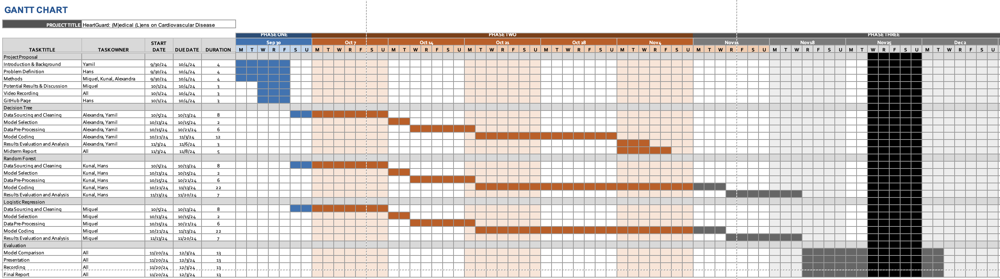

## 📚 References

[1] Ahmad, I., & Kalimullah, M. (2021). _Cardiovascular disease prediction using data mining techniques: A review_. International Journal of Advanced Computer Science and Applications, 12(1), 180-186. https://doi.org/10.14569/IJACSA.2021.0120124

[2] A. Ahmad and H. Polat, _Prediction of Heart Disease Based on Machine Learning Using Jellyfish Optimization Algorithm_, Diagnostics, vol. 13, no. 14, pp. 2392–2392, Jul. 2023, doi: https://doi.org/10.3390/diagnostics13142392

[3] C. M. Bhatt, P. Patel, T. Ghetia, and P. L. Mazzeo, _Effective Heart Disease Prediction Using Machine Learning Techniques_, Algorithms, vol. 16, no. 2, p. 88, Feb. 2023, doi: https://doi.org/10.3390/a16020088

---

## 📝 Additional Information

### Gantt Chart

---

### 👥 Contributions

- **Alexandra** - Results and Discussion, Report
- **Hans** - GitHub Web Page, Random Forest
- **Kunal** - Results and Discussion, Report
- **Miguel** - ML Method implementation, website
- **Yamil** - Data Preprocessing
