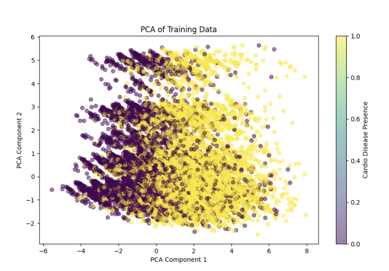
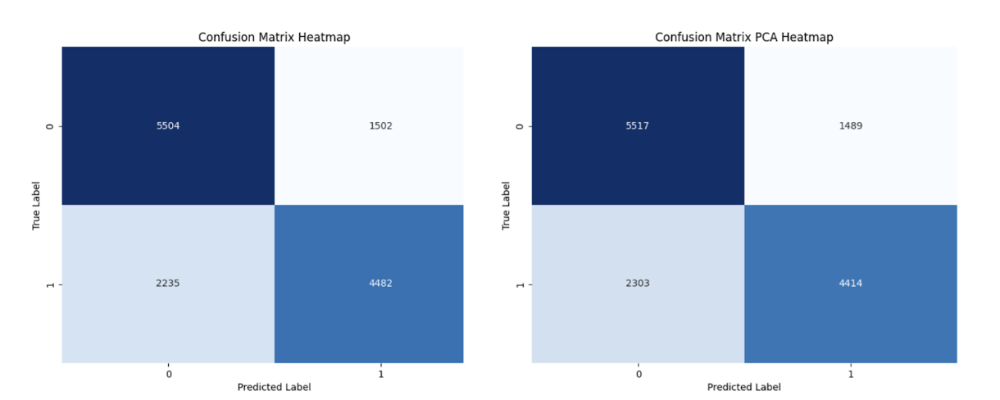

## Results 🏆

### **Logistic Regression**

Both **Part A** and **Part B** reveal similar feature relationships in predicting **CVD**. Strong correlations appear between **systolic (ap_hi)** and **diastolic (ap_lo)** blood pressure, as well as between **blood pressure** and **pulse pressure**. Minor differences in correlation strengths suggest variations due to different preprocessing methods, like **SMOTE** in Part B. **Blood pressure** and **cholesterol** emerge as key predictors, while **lifestyle factors** show weaker correlations.

###### _Figure 1. Feature Correlation Heatmap (Part A to the left, Part B to the right)_

#### **Part A 🔹**

The results highlight the model’s performance in predicting **CVD**. **PCA** shows data distribution, with **blood pressure correlations** prominent. **Confusion matrices** and an **AUC** of **0.79** indicate moderate accuracy. Key predictors are **ap_hi**, **ap_lo**, **cholesterol**, and **age**, marking them as crucial for assessing **CVD risk**.

###### _Figure 2. PCA of Training Data_

###### _Figure 3. ROC Curve (without, left and with PCA, right)_

###### _Figure 4. Confusion Matrix Heatmap (without, left and with PCA, right)_

###### _Figure 5. Permutation and Feature Importance_

#### **Part B 🔸**

Part B results show **logistic regression** and **SGD classifier** models effectively predicting **CVD**. The **feature correlation heatmap** highlights strong relationships, particularly among **blood pressure indicators**, with **cholesterol** and **age** as key **CVD predictors**. **Confusion matrices** demonstrate similar classification performance for both models, while **ROC curves** show moderate discriminatory power, with **AUCs** of **0.79** for logistic regression and **0.78** for SGD. **Blood pressure** and **cholesterol** emerge as primary factors in assessing **CVD risk**.

###### _Figure 6. Confusion Matrix Heatmap Part B_

###### _Figure 7. ROC Curve Part B_

---

### **Decision Tree**

The decision tree model achieved an **accuracy** of **72.84%**, demonstrating its ability to correctly classify the majority of instances in the dataset. The **precision** was **75.15%**, indicating that when the model predicted the presence of cardiovascular disease, **75%** of the predictions were correct. The **recall** was **66.50%**, suggesting that the model successfully identified about two-thirds of the actual cases of cardiovascular disease. Finally, the **F1-score**, a balance between precision and recall, was **70.56%**, reflecting the model's overall effectiveness in handling both false positives and false negatives. The **confusion matrix heatmap** visually highlights these results, showing the distribution of **true positives**, **true negatives**, **false positives**, and **false negatives**. Additionally, the **decision tree visualization** provides clear insights into the splitting criteria and feature importance used to make predictions.

###### _Figure 8. Decision Tree Visualization_

###### _Figure 9. Decision Tree Confusion Matrix Heatmap_

---

### **Random Forest**

The random forest model was evaluated at different **tree depths (3, 6, 9, and 12)** with and without **Principal Component Analysis (PCA)** for dimensionality reduction. At a depth of **3**, the model achieved an **accuracy** of **72%** for both PCA and non-PCA, with **precision** values of **76% (PCA)** and **75% (non-PCA)**. **Recall** was **64%** for both settings, resulting in an **F1-score** of **70%** for PCA and **69%** for non-PCA. Increasing the depth to **6** led to an **accuracy** of **73%**, with precision slightly higher for non-PCA (**76%**) compared to PCA (**75%**). The recall increased to **66%** for both configurations, and the F1-score remained at **70%**. At depths **9** and **12**, both PCA and non-PCA models reached similar performance levels, with an **accuracy** of **73%**, precision around **75-76%**, recall at **66-68%**, and an **F1-score** of **71%**. The **confusion matrix heatmaps** and **ROC curves** were also plotted for each depth which can be observed below:

---

## **Discussions**

---

### **Logistic Regression**

#### Logistic Regression with Fixed PCA for CVD Prediction 📊

The logistic regression models show similar performance, with the model without PCA performing slightly better (**accuracy 0.73, precision 0.75, recall 0.67, F1 score 0.71**) compared to the PCA model (**accuracy 0.72, precision 0.75, recall 0.66, F1 score 0.70**). The confusion matrices are also similar, indicating consistent classification results.

The odds ratios reveal that **ap_hi (1.57)** and **ap_lo (1.47)** are the strongest predictors of CVD, followed by **cholesterol (1.42)** and **age (1.40)**, indicating that higher values increase CVD risk. In contrast, factors like **smoke (0.96), alco (0.95), gluc (0.92)**, and **active (0.91)** show weaker or potentially protective effects. This suggests that **blood pressure and cholesterol** are more influential in predicting CVD than lifestyle factors.

---

#### Advanced CVD Prediction with SMOTE, Tuned PCA, and SGD 🚀

The results indicate similar performance between the **logistic regression** and **SGD classifier** models for predicting cardiovascular disease (CVD). The logistic regression model achieved an accuracy of **0.73**, with a precision of **0.74**, recall of **0.67**, and F1 score of **0.71**. Its confusion matrix shows **5,435 true negatives, 1,571 false positives, 2,198 false negatives**, and **4,519 true positives**.

The **SGD classifier**, on the other hand, had a slightly lower accuracy of **0.72**, with the same precision of **0.74**, recall of **0.67**, and a marginally lower F1 score of **0.70**. Its confusion matrix shows **5,399 true negatives, 1,607 false positives, 2,228 false negatives**, and **4,489 true positives**.

Overall, the logistic regression model performed marginally better in terms of accuracy and F1 score, while precision and recall remained the same for both models. The SGD classifier exhibited a slightly higher rate of false positives and false negatives, which impacted its overall accuracy and F1 score. This comparison suggests that logistic regression may offer a slight edge in predictive accuracy for this dataset, though both models perform similarly in terms of precision and recall, providing consistent results across different metrics.

---

### **Decision Tree**

The results indicate that the decision tree model is moderately effective for predicting cardiovascular disease. The high precision (**75.15%**) is valuable in minimizing false positives, which is crucial in medical applications to avoid unnecessary testing or treatments for individuals not at risk. However, the recall (**66.50%**) suggests that the model missed approximately one-third of the true cases, which could lead to underdiagnosis. This trade-off is reflected in the F1-score (**70.56%**), which balances the model’s precision and recall.

The confusion matrix highlights a considerable number of false negatives, which may warrant further optimization to improve recall. The Decision Tree model identified **systolic blood pressure**, **diastolic blood pressure**, and **cholesterol levels** as the most significant features influencing predictions. These findings align closely with clinical knowledge, as these metrics are well-known indicators of cardiovascular health. Additionally, lifestyle factors such as **smoking** and **physical activity** played a smaller role, indicating that the model prioritized physiological measures over behavioral data when making decisions.

Increasing the tree's depth or employing ensemble methods, such as **random forests**, could address this issue by capturing more complex patterns in the data. The decision tree visualization emphasizes the interpretability of the model, allowing stakeholders to understand the criteria driving predictions. Despite its limitations, the model's performance is a good starting point, providing actionable insights into the factors influencing cardiovascular disease risk. Future iterations could focus on enhancing recall to ensure more comprehensive detection of at-risk individuals.

---

### **Random Forest**

The results demonstrate that the random forest model is effective in predicting cardiovascular disease with an accuracy of **72%-73%**, which is above the threshold accuracy for this project. The precision of around **75-76%** for all models suggests that the model was able to minimize false positives, which is crucial in medical contexts to reduce unnecessary interventions. However, the recall, ranging from **64% to 68%**, suggests that the model still missed a notable proportion of actual CVD cases, especially at lower depths. This trade-off between precision and recall is balanced with an F1-score of around **70-71%**, indicating an overall stable performance across all settings. The confusion matrices for each depth show that false positives were generally reduced as depth increased, and more true positives were captured.

Furthermore, it is important to consider the impact of using PCA on the model, as it did not significantly impact its performance. The accuracy, precision, recall, and F1-score were very similar between PCA and non-PCA models. However, PCA led to a slight improvement in recall, particularly at higher depths. This suggests that PCA may help reduce noise in the data, allowing the random forest to focus on the most important features.

The use of PCA also resulted in fewer false positives and more true positives, as shown by the confusion matrices. Despite the similar overall performance, the use of PCA could be useful in reducing computational load and enhancing model interpretability without sacrificing accuracy.

## 🌟 **Overall**

The overall results from this project indicate that machine learning techniques such as **Logistic Regression**, **Decision Trees**, and **Random Forests** are viable options for predicting cardiovascular disease (CVD) based on health and lifestyle features. Each model demonstrated strengths in terms of accuracy and precision, but also highlighted some weaknesses, particularly in recall, which is crucial for minimizing false negatives in a medical context. The use of **PCA** for dimensionality reduction had mixed effects across the different models, with slight improvements in recall but no significant changes in overall accuracy or precision.

---

### **Logistic Regression**

**Logistic Regression** was effective in providing interpretability and producing probabilities for each prediction, making it a useful model for risk assessment in clinical settings. However, it suffered from slightly lower recall, particularly when class imbalance was not addressed. The advanced model with **SMOTE** and **hyperparameter tuning** yielded better-balanced results, reducing false negatives and improving overall robustness. Logistic Regression's **feature importance analysis** provided valuable insights, emphasizing **blood pressure** and **cholesterol** as key indicators of CVD risk.

---

### **Decision Trees**

**Decision Trees** offered interpretability, allowing stakeholders to understand the decision-making process clearly. The model's precision was relatively high, minimizing false positives, but the recall was moderate, indicating missed CVD cases. This trade-off suggests that while Decision Trees are informative and useful for preliminary assessments, they might require enhancements—such as increased depth or ensemble methods—to fully capture the complexity of CVD risk factors and reduce underdiagnosis. The visualization of decision paths helped in identifying how individual health metrics contributed to the final predictions, underscoring the transparency of this approach.

The Decision Tree model's interpretability makes it particularly suited for applications in clinical settings. By providing clear and understandable decision paths, it can assist healthcare professionals in explaining CVD risk assessments to patients. This transparency not only aids decision-making but also fosters trust in machine learning tools as part of the diagnostic process. Furthermore, its ability to highlight critical risk factors could support preventative strategies by enabling targeted interventions.

---

### **Random Forests**

**Random Forests** proved to be the most effective model in terms of balanced accuracy, precision, and recall. The ensemble nature of Random Forests provided robustness against noise and variability in patient data, capturing non-linear relationships among features. The model performed consistently across different depths, and while increasing depth led to minor improvements in recall, it also risked overfitting. **PCA** had a slight positive impact on recall, reducing noise and improving sensitivity without significantly affecting accuracy or precision. The **feature importance analysis** from Random Forests provided insights into the factors most critical for predicting CVD, reaffirming the importance of **blood pressure, cholesterol, and age**.

---

### **Conclusion**

In conclusion, the results indicate that **Random Forests** are the most promising model for predicting cardiovascular disease, offering a good balance between interpretability, accuracy, and sensitivity. However, the recall values across all models suggest a need for further improvement to ensure comprehensive detection of at-risk individuals. Future work could include **hyperparameter tuning for Random Forests**, incorporating additional data sources, and exploring more advanced ensemble techniques to improve recall and overall predictive performance. Additionally, more attention to reducing false negatives will enhance early intervention efforts, ultimately improving patient outcomes.
