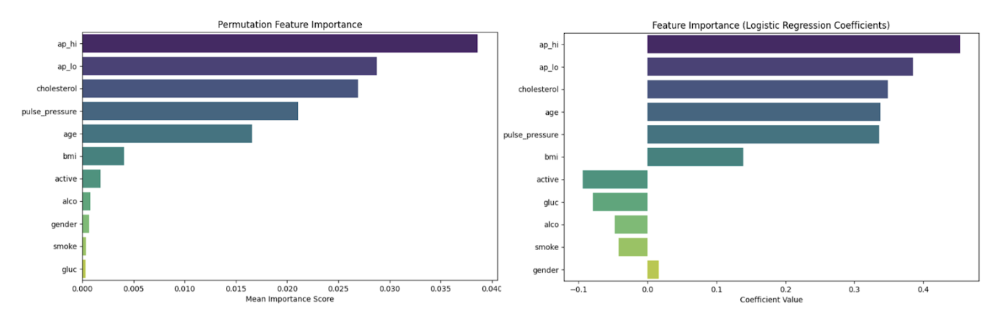

# Results

Both Part A and B reveal similar feature relationships in predicting CVD. Strong correlations appear between systolic (ap_hi) and diastolic (ap_lo) blood pressure, as well as between blood pressure and pulse pressure. Minor differences in correlation strengths suggest variations due to different preprocessing methods, like SMOTE in Part B. Blood pressure and cholesterol emerge as key predictors, while lifestyle factors show weaker correlations.

###### Figure 1. Feature Correlation Heatmap (Part A to the left, Part B to the right)

**Part A**
The results highlight the model's performance in predicting CVD. PCA shows data distribution, with blood pressure correlations prominent. Confusion matrices and an AUC of 0.79 indicate moderate accuracy. Key predictors are ap_hi, ap_lo, cholesterol, and age, marking them as crucial for assessing CVD risk.

**Part B**
Part B results show logistic regression and SGD classifier models effectively predicting CVD. The feature correlation heatmap highlights strong relationships, particularly among blood pressure indicators, with cholesterol and age as key CVD predictors. Confusion matrices demonstrate similar classification performance for both models, while ROC curves show moderate discriminatory power, with AUCs of 0.79 for logistic regression and 0.78 for SGD. Blood pressure and cholesterol emerge as primary factors in assessing CVD risk.

# Discussion

## Logistic Regression with Fixed PCA for CVD Prediction

The logistic regression models show similar performance, with the model without PCA performing slightly better (accuracy 0.73, precision 0.75, recall 0.67, F1 score 0.71) compared to the PCA model (accuracy 0.72, precision 0.75, recall 0.66, F1 score 0.70). The confusion matrices are also similar, indicating consistent classification results.
The odds ratios reveal that ap_hi (1.57) and ap_lo (1.47) are the strongest predictors of CVD, followed by cholesterol (1.42) and age (1.40), indicating that higher values increase CVD risk. In contrast, factors like smoke (0.96), alco (0.95), gluc (0.92), and active (0.91) show weaker or potentially protective effects. This suggests that blood pressure and cholesterol are more influential in predicting CVD than lifestyle factors.

## Advanced CVD Prediction with SMOTE, Tuned PCA, and SGD

The results indicate similar performance between the logistic regression and SGD classifier models for predicting cardiovascular disease (CVD). The logistic regression model achieved an accuracy of 0.73, with a precision of 0.74, recall of 0.67, and F1 score of 0.71. Its confusion matrix shows 5,435 true negatives, 1,571 false positives, 2,198 false negatives, and 4,519 true positives. The SGD classifier, on the other hand, had a slightly lower accuracy of 0.72, with the same precision of 0.74, recall of 0.67, and a marginally lower F1 score of 0.70. Its confusion matrix shows 5,399 true negatives, 1,607 false positives, 2,228 false negatives, and 4,489 true positives.
Overall, the logistic regression model performed marginally better in terms of accuracy and F1 score, while precision and recall remained the same for both models. The SGD classifier exhibited a slightly higher rate of false positives and false negatives, which impacted its overall accuracy and F1 score. This comparison suggests that logistic regression may offer a slight edge in predictive accuracy for this dataset, though both models perform similarly in terms of precision and recall, providing consistent results across different metrics.

## Overall

The results from our model are not as great as we expected, but still very important nonetheless. In information models like these, having a 1% difference in a database of about 5,000 entries means 50 people can have more accurate information about their cardiovascular health.  This could mean that using a model of much more information, say 500,000 people, would be critical.

There are some important observations in all figures:
- A cold correlation on the Correlation Heatmap indicates there may be some anti-relation between the two variables. For example, gender and BMI are negatively correlated. This means the model observes that a specific gender may have a lower BMI. This is interesting: our data model interpreted that, on average, males have a lower BMI than females. This may incur further inspection: it should be that males have higher BMI on average than females. Either this means our training database could be faulty, or the model is accurate and the values obtained from the database just happen to have women’s BMI higher than men’s on average.
- The warmest relation is between Pulse Pressure and the Systolic Pressure. This is to be expected - after all, part of its formula includes the systolic and diastolic pressures. What is interesting, though, is the fact that it is not closer to 100% (or 1). This is because of variation in people’s systolic and diastolic blood pressures - for example, two people with a systolic pulse of 120 can have different diastolic pulses of, say, 65 and 75.
- Compared to the SGD model, 66 more people either got a True Positive or a True Negative. For a model, that’s not much, but in health services 66 people is a good amount of people. As mentioned earlier, a 1% change in model can be critical to saving a lot of money and a lot of lives.
- The difference in AUCs from the SGD and LogReg curve is 1%. This proves LogReg would be better as a model for determining health decisions as compared to SGD.

## Next Steps

The next steps of the project include implementing random forests and decisions trees to see if they are better at predicting CVD presence. The logistic regression model will also be tuned to potentially achieve better results. Nonetheless, overall the results were above the threshold set during the proposal of above 0.70 and it is similar to the results obtained from existing literature.

