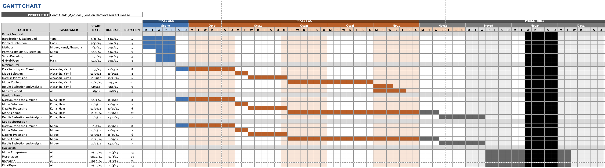

## 📚 References

[1] Ahmad, I., & Kalimullah, M. (2021). *Cardiovascular disease prediction using data mining techniques: A review*. International Journal of Advanced Computer Science and Applications, 12(1), 180-186. https://doi.org/10.14569/IJACSA.2021.0120124

[2] A. Ahmad and H. Polat, *Prediction of Heart Disease Based on Machine Learning Using Jellyfish Optimization Algorithm*, Diagnostics, vol. 13, no. 14, pp. 2392–2392, Jul. 2023, doi: https://doi.org/10.3390/diagnostics13142392

[3] C. M. Bhatt, P. Patel, T. Ghetia, and P. L. Mazzeo, *Effective Heart Disease Prediction Using Machine Learning Techniques*, Algorithms, vol. 16, no. 2, p. 88, Feb. 2023, doi: https://doi.org/10.3390/a16020088

---

## 📝 Additional Information

### Gantt Chart

[Include your Gantt chart image or link here.]

---

### 👥 Contributions

- **Alexandra** - Methods, Dataset
- **Hans** - GitHub Page, Problem Definition
- **Kunal** - Methods
- **Miguel** - Methods, Results & Discussion
- **Yamil** - Intro/Background

---

